# 1Password MCP Server

A secure Model Context Protocol (MCP) server that provides authenticated 1Password credential retrieval with comprehensive error handling, resilience patterns, security hardening, and full MCP protocol compliance.

## Overview

The 1Password MCP Server enables AI assistants like Claude to securely retrieve credentials from your 1Password vaults. Built with enterprise-grade security, comprehensive error handling, and operational excellence in mind.

### Key Features

- **🔐 Secure by Default**: Memory protection, request signing, TLS enforcement
- **🛡️ Enterprise Security**: Service account authentication, audit logging, rate limiting
- **⚡ High Performance**: Circuit breakers, retry logic, performance monitoring
- **📊 Observable**: Structured logging, health checks, metrics collection
- **🔧 Production Ready**: Comprehensive testing, documentation, monitoring

## Quick Start

### Prerequisites

- Python 3.12+
- 1Password service account token
- Claude Desktop or compatible MCP client

### Installation

```bash
# Install via pip
pip install onepassword-mcp-server

# Or install with optional dependencies
pip install onepassword-mcp-server[dev,docs]
```

### Configuration

1. **Get 1Password Service Account Token**:
   - Go to [1Password Developer Console](https://developer.1password.com/)
   - Create a service account
   - Grant access to required vaults
   - Copy the service account token

2. **Configure Environment**:
   ```bash
   export OP_SERVICE_ACCOUNT_TOKEN=ops_your_service_account_token_here
   export SECURITY_DEFAULT_VAULT=AI  # Optional: default vault name
   ```

3. **Configure Claude Desktop** (`claude_desktop_config.json`):
   ```json
   {
     "mcpServers": {
       "onepassword": {
         "command": "onepassword-mcp-server",
         "env": {
           "OP_SERVICE_ACCOUNT_TOKEN": "ops_your_service_account_token_here"
         }
       }
     }
   }
   ```

### Usage

Once configured, you can ask Claude to retrieve credentials:

> "Please get my GitHub credentials from 1Password"

The server will securely retrieve and provide the username and password while maintaining complete audit trails.

## Architecture

```mermaid
graph TB
    A[AI Assistant<br/>Claude] -->|MCP Protocol| B[1Password MCP Server]
    B -->|Authenticated API| C[1Password Service]
    
    B --> D[Security Layer<br/>🛡️ Memory Protection<br/>🔐 Request Signing<br/>📝 Audit Logging]
    B --> E[Resilience Layer<br/>⚡ Circuit Breaker<br/>🔄 Retry Logic<br/>⏱️ Timeouts]
    B --> F[Monitoring Layer<br/>📊 Health Checks<br/>📈 Metrics<br/>🔍 Observability]
```



## Security Model

### Defense in Depth

1. **Authentication**: Service account tokens with vault-scoped access
2. **Input Validation**: Comprehensive parameter validation and sanitization
3. **Memory Protection**: Secure credential handling with automatic cleanup
4. **Transport Security**: TLS enforcement and request signing
5. **Audit Logging**: Complete request/response tracking with correlation IDs
6. **Rate Limiting**: Configurable rate limits to prevent abuse

### Production Security

- **No Credential Caching**: Always fetch fresh credentials
- **Secure Error Messages**: No information leakage in error responses
- **Environment Validation**: Security posture assessment
- **Compliance Ready**: SOC 2 compliance support

## Tools Available

### `get_1password_credentials`

Securely retrieve credentials from 1Password.

**Parameters**:
- `item_name` (required): Name of the 1Password item
- `vault` (optional): Name of the 1Password vault

**Example**:
```bash
# Via Claude
"Get my database credentials for production"

# Direct tool response
{
  "username": "admin@company.com",
  "password": "secure_password_here",
  "item_name": "database-prod",
  "vault": "Infrastructure"
}
```

### `get_health_status`

Get comprehensive health status of all server components.

### `get_metrics`

Get operational metrics including performance data and security insights.

### `get_security_status`

Get security hardening status and configuration validation.

## Documentation

- **[Setup Guide](SETUP_GUIDE.md)** - Detailed installation and configuration
- **[Security Guide](SECURITY_GUIDE.md)** - Security best practices and policies
- **[API Reference](API_REFERENCE.md)** - Complete tool documentation
- **[Troubleshooting](TROUBLESHOOTING.md)** - Common issues and solutions
- **[Developer Guide](DEVELOPER_GUIDE.md)** - Development and contribution guide

## Support

- **GitHub**: [Issues and feature requests](https://github.com/jon-the-dev/1password-mcp-server/issues)
- **Security**: [Security policy](https://github.com/jon-the-dev/1password-mcp-server/security)
- **Documentation**: [Complete documentation](https://jon-the-dev.github.io/1password-mcp-server/)

## License

MIT License - see [LICENSE](LICENSE) for details.

---

**Ready to get started?** Follow the [Setup Guide](SETUP_GUIDE.md) for detailed installation instructions.